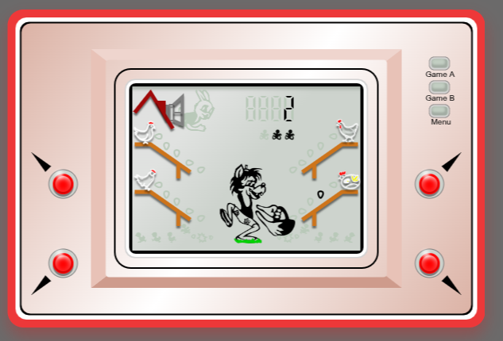

# MyGame
# Wolf Egg Catcher 🎮



## Description
"Wolf Egg Catcher" is a browser game built with **React** and **Vite**, using **ES6+ classes** and **Canvas**. The game is inspired by old handheld game consoles (like the Game Boy), where the player controls a wolf trying to catch falling eggs.

## Technologies
- React  
- Vite  
- JavaScript (ES6+ classes)  
- Canvas API  

## How to Play
- Use the buttons or keyboard controls to move the wolf (R-F-U-J)
- Catch as many eggs as possible and avoid missing them.  

## Preview / Play Online
[Play the game online](https://my-game-fqafnhybp-nathalys-projects-00e3c987.vercel.app)

## Setup Locally
```bash
git clone <your-repo-url>
cd <your-project-folder>
npm install
npm run dev
